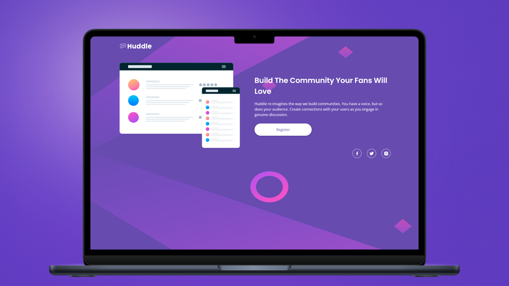

<h1 align="center">Huddle Landing Page With a Single Introductory Section</h1>

<p align="left">
  <a href="README_ES.md" target="_blank">
    Ver README en Español
  </a>
</p>

<p>
  This project is a responsive implementation of the "Huddle Landing Page with a Single Introductory Section" from Frontend Mentor. It was created to improve and reinforce my knowledge of semantic HTML, CSS architecture using the BEM (Block, Element, Modifier) methodology, and layout techniques with Flexbox. This beginner-friendly challenge was the perfect opportunity to build a clean two-column layout while following best practices in frontend development.
</p>

<hr>

<h1 align="center">Technologies Used</h1>

<div align="center">
  
  
</div>

<hr>

<h1 align="center">Objective</h1>

<p>
  This project was specifically designed as a structured and challenging learning experience. Through the application of the BEM methodology, I focused on writing modular and readable CSS. Flexbox was essential in creating a flexible and responsive two-column layout that adapts smoothly to various screen sizes.
</p>

<hr>

<h1 align="center">Main Features</h1>

<ul>
  <li><b>BEM Methodology:</b> Clean and scalable CSS architecture using BEM to maintain modularity and clarity in the codebase.</li>
  <li><b>Two-Column Layout:</b> Responsive two-column design implemented using Flexbox for better structure and adaptability.</li>
</ul>

<hr>

<h1 align="center">Skills Acquired</h1>

<ul>
  <li>Reinforced fundamental concepts of semantic HTML and structured CSS.</li>
  <li>Applied BEM methodology to organize CSS in a clean and maintainable way.</li>
  <li>Used Flexbox effectively to build responsive layouts with two-column structure.</li>
</ul>

<hr>

<h1 align="center">How to Use</h1>

1. Clone this repository to your local machine:

   ```sh
   git clone https://github.com/jordanmedinaortiz/huddle-landing-page-with-a-single-introductory-section.git
   cd huddle-landing-page-with-a-single-introductory-section
    ```
2. Open the index.html file in your preferred web browser.

3. Explore the introductory section layout and observe the use of HTML structure, BEM methodology, and Flexbox.

<p> This project has been a valuable hands-on experience, helping consolidate essential frontend development skills. It is especially suitable for beginners aiming to apply best practices from the start. </p>
<p> You can view the live demo <a href="https://jordanmedinaortiz.github.io/huddle-landing-page-with-a-single-introductory-section/" target="_blank">here</a>. </p>

