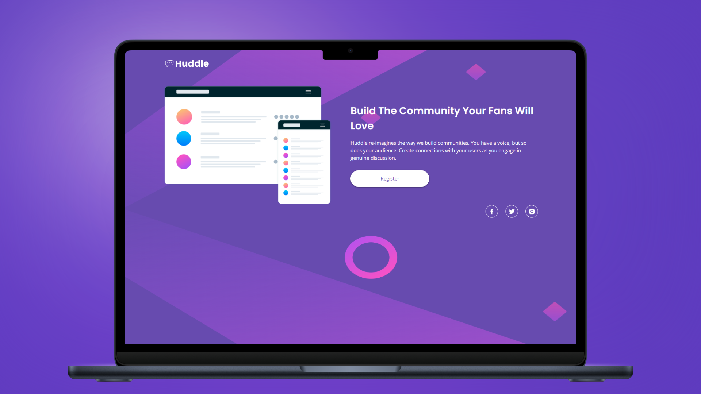

<h1 align="center">Huddle Landing Page con Una Sola Sección Introductoria</h1>

<p align="left">
  <a href="README.md" target="_blank">
    View README in English
  </a>
</p>

<p>
  Este proyecto es una implementación responsive de la landing page "Huddle con una sola sección introductoria" de Frontend Mentor. Fue desarrollado con el objetivo de mejorar y consolidar mis conocimientos en HTML semántico, arquitectura CSS utilizando la metodología BEM (Block, Element, Modifier), y técnicas de maquetación con Flexbox. Es un reto ideal para principiantes, que me permitió trabajar con un diseño de dos columnas siguiendo buenas prácticas de desarrollo frontend.
</p>

<hr>

<h1 align="center">Tecnologías Utilizadas</h1>

<div align="center">
  
  
</div>

<hr>

<h1 align="center">Objetivo</h1>

<p>
  Este proyecto fue diseñado como una experiencia de aprendizaje estructurada y desafiante. A través de la aplicación de la metodología BEM, me enfoqué en escribir un CSS modular y legible. Flexbox fue fundamental para crear un diseño flexible y responsive de dos columnas que se adapta de manera eficiente a distintos tamaños de pantalla.
</p>

<hr>

<h1 align="center">Características Principales</h1>

<ul>
  <li><b>Metodología BEM:</b> Arquitectura CSS limpia y escalable utilizando BEM, lo que facilita el mantenimiento y la claridad del código.</li>
  <li><b>Diseño de Dos Columnas:</b> Estructura responsive en dos columnas, implementada con Flexbox para mejorar la organización visual y la adaptabilidad.</li>
</ul>

<hr>

<h1 align="center">Aprendizajes Adquiridos</h1>

<ul>
  <li>Reforzamiento de los conceptos fundamentales de HTML semántico y CSS estructurado.</li>
  <li>Aplicación de la metodología BEM para mantener un código CSS modular y mantenible.</li>
  <li>Uso efectivo de Flexbox para construir diseños responsive de dos columnas.</li>
</ul>

<hr>

<h1 align="center">Instrucciones de Uso</h1>

1. Clona este repositorio en tu máquina local:

   ```sh
   git clone https://github.com/jordanmedinaortiz/huddle-landing-page-with-a-single-introductory-section.git
   cd huddle-landing-page-with-a-single-introductory-section
   
2. Abre el archivo index.html en tu navegador web preferido.

3. Explora la sección introductoria y observa cómo se implementaron HTML, Flexbox y la metodología BEM.

<p> Este proyecto ha sido una experiencia de aprendizaje práctica muy valiosa, contribuyendo a la consolidación de habilidades fundamentales en el desarrollo frontend. Es especialmente útil para quienes están comenzando en el diseño y desarrollo web, ya que promueve el uso de buenas prácticas desde el inicio. </p>
<p> Puedes ver la demostración en vivo del proyecto <a href="https://jordanmedinaortiz.github.io/huddle-landing-page-with-a-single-introductory-section/" target="_blank">aquí</a>.
</p> 
